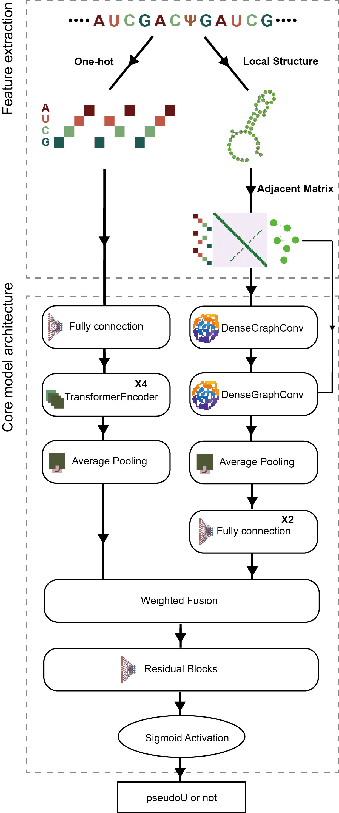

# pseU_NN
A hybrid transformer-GNN architecture that integrates RNA secondary structural features with sequence information to predict potential pseudouridine (Ψ) modifications in bacterial transcriptomes.

## Workflow

<div align="center">
  
</div>


## Installation

## 1. Create a conda env
pseU_NN has been primarily trained and tested on Python **3.10**, with additional test runs conducted across Python versions **3.9** to **3.11**. The MXfold2 (https://github.com/mxfold/mxfold2) is required to be installed.
```
conda create -n PseU_NN_env python=3.10 
conda activate PseU_NN_env
conda install -c bioconda bedtools=2.30.0 seqkit=2.9.0 
```

## 2. Install from pip
```
git clone https://github.com/Dylan-LT/pseU_NN
cd pseU_NN/
pip install -r requirement.txt
```

## Manual
We have provided two scripts: `predictor.py` and `predictor.sh`. The `predictor.py` script is designed to predict secondary structure files in bpseq format. The `predictor.sh` script is intended to process sequences directly (**recommended method**).

### Input files preparation
The input files required by `predictor.py` are directories containing RNA secondary structure files in **BPSEQ** format named sequence_1.bpseq to sequence_n.bpseq (optional information file: in .**bed** format with exact same order of file in input directory).
```
NZ_CP040539.1   352254  352255  .       .       +
```
The input files for `predictor.sh` are a **genome sequence reference** file (in .**fa**, .**fasta**, or .**fna** format) and an **annotation** file (in .**gff** format). 

### Command options
The `predictor.py` module calculates the probability of **61-nucleotide** RNA segment containing pseudouridine modifications.
To view the available options for this script, run `python predictor.py -h` in the command line.

#### predictor.py
```
usage: predictor.py [-h] [-i INPUT_FOLDER] [--model MODEL] [-o OUTPUT] [--batch_size BATCH_SIZE] [--bed BED] [--subsample_number SUBSAMPLE_NUMBER] [--device DEVICE]

Process some integers.

options:
  -h, --help            show this help message and exit
  -i INPUT_FOLDER, --input_folder INPUT_FOLDER
                        Directory path to input files
  --model MODEL         Path to the model file
  -o OUTPUT, --output OUTPUT
                        Output csv path
  --batch_size BATCH_SIZE
                        batch_size of input feature
  --bed BED             bed file used to extract sequence
  --subsample_number SUBSAMPLE_NUMBER
                        Subsample number if required
  --device DEVICE       Device name
```
#### predictor.sh
The `predictor.sh` module identifies unique pseudouridine-containing motifs and scans the provided FASTA file for matches, filtering for overlaps with coding sequences. It then processes each identified motif to predict all potential pseudouridine modification sites across the genome.
```
Usage: predictor.sh <input_fasta> <input_gff> <output_tsv>

DESCRIPTION:
    Pipeline for pseudouridine site prediction in bacterial RNA.

ARGUMENTS:
    <input_fasta> : FASTA file
    <input_gff>   : GFF file containing coding region annotations
    <output_tsv>  : Output TSV filename (prediction results)

EXAMPLE:
    predictor.sh genome.fasta annotation.gff results.tsv
```
### Output description
The output of `predictor.py` and `predictor.sh` is in .**csv** format containing the possibility of Ψ modification.

| Column Name  | Description                 |
|--------------|-----------------------------|
| chrom        | Chromosome name or identifier|
| start        | Start position  |
| end          | End position    |
| motif        | The specific motif sequence |
| strand       | Strand orientation (+ or -) |
| possibility  | Probability or confidence score |

### Example
We have included sample data to facilitate testing and comprehension of our script.
```
# run predictor.py
python predictor.py -i data/test1/bpseq/ --bed data/test1/test.bed -o data/test1/test --device cuda:0 --model model.pth
# run predictor.sh
bash predictor.sh data/test2/fasta.fa data/test2/genomic.gff data/test2/results.csv
```
