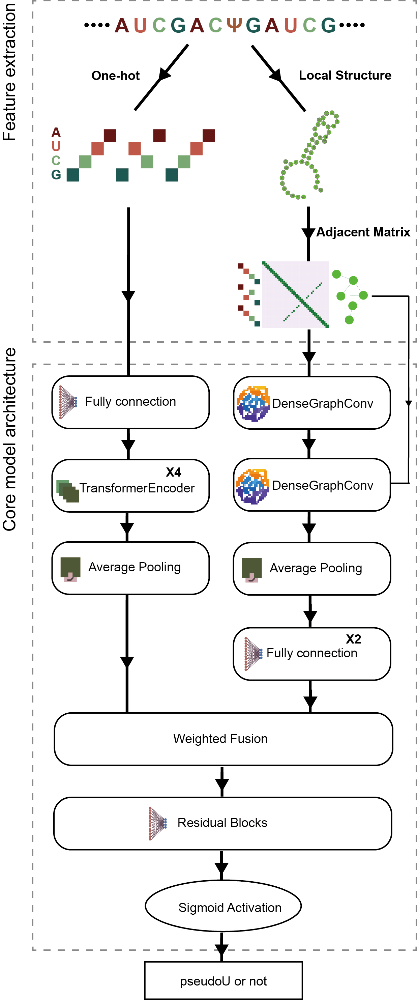

# pseU_NN
A hybrid transformer-GNN architecture that integrates RNA secondary structural features with sequence information to predict potential pseudouridine (Ψ) modifications in bacterial transcriptomes.

## Workflow

<div align="center">
  
</div>


## Installation

## 1. Create a conda env
pseU_NN has been primarily trained and tested on Python **3.10**, with additional test runs conducted across Python versions **3.9** to **3.11**.
```
conda create -n PseU_NN_env python=3.10 
conda activate PseU_NN_env
conda install -c bioconda bedtools=2.30.0 seqkit=2.9.0 
```

## 2. Install from pip
```
git clone https://github.com/Dylan-LT/pseU_NN
pip install -r requirement.txt
```

## Manual

### Input
The input files required by `predictor.py` are directory containing RNA secondary structure file in **BPSEQ** format (optional: information file in .**bed** format with exxact same order of file in input directory).
```
NZ_CP040539.1   352254  352255  .       .       +
```
The input files for `predictor.sh` are a **genome sequence reference** file (in .**fa**, .**fasta**, or .**fna** format) and an **annotation** file (in .**gff** format). 

### Predictor.py
The `predictor.py` module calculates the probability of 61-nucleotide RNA segment contains pseudouridine modifications.
To view the available options for this script, run `python predictor.py -h` in the command line.
#### Options
```
usage: predictor.py [-h] [-i INPUT_FOLDER] [--model MODEL] [-o OUTPUT] [--batch_size BATCH_SIZE] [--bed BED] [--subsample_number SUBSAMPLE_NUMBER] [--device DEVICE]

Process some integers.

options:
  -h, --help            show this help message and exit
  -i INPUT_FOLDER, --input_folder INPUT_FOLDER
                        Directory path to input files
  --model MODEL         Path to the model file
  -o OUTPUT, --output OUTPUT
                        Output csv path
  --batch_size BATCH_SIZE
                        batch_size of input feature
  --bed BED             bed file used to extract sequence
  --subsample_number SUBSAMPLE_NUMBER
                        Subsample number if required
  --device DEVICE       Device name
```
#### Output description
Output of `predictor.py` is in .**csv** format.
```
chrom,start,end,motif,strand,posibility

```
#### Example
```
python predictor.py -i bpseq/ --bed test.bed -o test --device cuda:0 --model model.pth
cat test.csv

chrom,start,end,motif,strand,posibility
NZ_CP040539.1,352254,352255,.,+,0.88555264
```